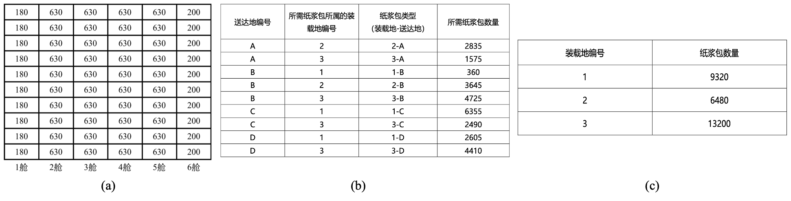
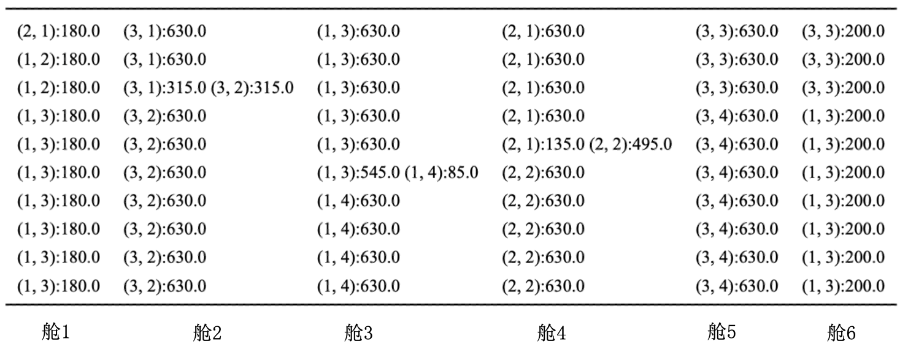

# Gurobi Solution for Pulp Carrier Ship Sequential Loading and Unloading Decision-making Task
# 纸浆运载船顺序装卸决策任务的Gurobi解决方案

## 问题背景介绍

本任务是解决一艘纸浆运输船的顺序装载的决策问题 。船分为六个舱口，每个舱口有十层，每舱每层会纸浆包的最大装载数量（如图1(a)所示）。每个装载地需要来自不同编号装载地的纸包，具体数量和信息如图1（b）所示。每个装载地能提供的纸包最大数量如图1（c）所示。该任务的核心是优化船舶内部纸浆包的存放，确保在不同装载和送达地之间的转移过程中高效、合理地利用船舶空间。



<center>图1


## 数学符号说明

以下是本篇报告中所用的数学符号说明。

<center>表1


| 符号                  | 说明                                       |
| --------------------- | ------------------------------------------ |
| n                     | 舱室的数量                                 |
| m                     | 每个舱室的层数                             |
| C[i,  j]              | 第i舱第j层的最大容量                       |
| S                     | 装载地的数量                               |
| D                     | 送达地的数量                               |
| P[s]                  | 装载地s能提供的纸浆包的最大数量            |
| Q[s, d]               | 送达地d需要装载地s运送的纸浆包数量         |
| cargo[i, j, s, d]     | 第i舱第j层从s发往d的纸浆包数量             |
| has_cargo[i, j, s, d] | 表示第i舱第j层是否有从s发往d的货物（bool） |
| mix[i, j]             | 第i舱第j层是否发生混装                     |

==为了模型描述方便，我将运达地A、B、C、D用编号1，2，3，4代替。==

## 约束与目标函数

### 模型约束

- **约束0**

  第i舱第j层从s发往d的纸浆包数量必须是非负整数。

  $$
  cargo[i, j, s, d] \geq 0, \quad \forall i \in \{1, \ldots, n\}, j \in \{1, \ldots, m\},\forall s \in \{1, \ldots, S\}, d \in \{1, \ldots, D\}
  $$

- **约束1**

  舱室容量限制，第i舱室第j层的纸浆包数量不能超过C[i,j]。数学语言描述如下：

  $$
  \sum_{s=1}^{S} \sum_{d=1}^{D} cargo[i, j, s, d] \leq C[i, j], \quad \forall i \in \{1, \ldots, n\}, j \in \{1, \ldots, m\}
  $$

- **约束2**

  装载地供应限制，所有从装载地s装载的纸浆包数量不能超过P[s]。数学语言描述如下：

  $$
  \sum_{i=1}^{n} \sum_{j=1}^{m} \sum_{d=1}^{D} cargo[i, j, s, d] \leq P[s], \quad \forall s \in \{1, \ldots, S\}
  $$

- **约束3**

  送达地需求限制，所有送达地d的需求必须满足到货量不能小于Q[s, d]。数学语言描述如下：

  $$
  \sum_{i=1}^{n} \sum_{j=1}^{m} \sum_{s=1}^{S} cargo[i, j, s, d] \geq Q[s, d], \quad \forall d \in \{1, \ldots, D\}
  $$

- **约束4**

  装卸限制，由于船舶是从装载地 1 出发，顺序经过装载地 1、2、3、送达地 A、B、C、D。在每个舱室，来自装载地s的纸浆包总在来自装载地s+1的纸浆包之下。在每个舱室，去往送达地d的纸浆包总在去往送达地d+1的纸浆包之上。用“$\Rightarrow$”表示“如果...则...”的逻辑关系，则约束4可以用以下数学语言描述:

  装载限制：

  $$
  cargo[i,j,s,d] > 0 \Rightarrow \sum_{j\_=1}^{j-1} \sum_{s\_=s+1}^{S} \sum_{d\_=1}^{D}cargo[i, j\_, s\_, d\_] = 0,\\ \quad \forall i \in \{1, \ldots, n\}, \quad \forall j \in \{1, \ldots, m\}
  $$

  卸载限制：

  $$
  cargo[i,j,s,d] > 0 \Rightarrow \sum_{j\_=1}^{j-1} \sum_{s\_=1}^{S} \sum_{d\_=1}^{d-1}cargo[i, j\_, s\_, d\_] = 0,\\ \quad \forall i \in \{1, \ldots, n\}, \quad \forall j \in \{1, \ldots, m\}
  $$

- **约束5**

  在每个装载或卸载地时，不能同时打开 2、3 舱和 4、5 舱。换句话说，2舱和3舱与4舱和5舱不能装载相同s或相同d的货物。数学语言描述如下：

  $$
  \sum_{j=1}^{m} \sum_{d=1}^{D}cargo[2, j, s, d]>0 \Rightarrow \sum_{j=1}^{m} \sum_{d=1}^{D}cargo[3, j, s, d]=0,\quad \forall s, \forall d
  \\
  \sum_{j=1}^{m} \sum_{d=1}^{D}cargo[3, j, s, d]>0 \Rightarrow \sum_{j=1}^{m} \sum_{d=1}^{D}cargo[2, j, s, d]=0,\quad \forall s, \forall d
  \\
  \sum_{j=1}^{m} \sum_{s=1}^{S}cargo[4, j, s, d]>0 \Rightarrow \sum_{j=1}^{m} \sum_{d=1}^{D}cargo[5, j, s, d]=0,\quad \forall s, \forall d
  \\
  \sum_{j=1}^{m} \sum_{s=1}^{S}cargo[5, j, s, d]>0 \Rightarrow \sum_{j=1}^{m} \sum_{d=1}^{D}cargo[4, j, s, d]=0,\quad \forall s, \forall d
  $$

### 目标函数

不同装载地-送达地的纸浆包混装在同层的次数尽可能少，数学语言表示如下：

$$
goal = Min(\sum_{i,j = 1}^{n,m} mix[i,j])
$$

## 模型建立与求解

使用gurobi建模并求解。

### 导入相关库

```python
import gurobipy as gp
from gurobipy import GRB
from gurobipy import Model
import pandas as pd
import numpy as np
import os
```

### 导入数据（数据分离）

我将每个舱室的总量存放在excel表中，命名为input_cargo_capacity.xlsx，从外部导入数据。我在数据定义上没有使用数组而是使用了哈希表，这样做有几个好处：

1. 哈希表的读取速度比较快，这对于需要频繁读取或更新数据的优化模型来说非常有用。
2. 直接通过键[i, j, s, d]来存储和访问数据，代码变得更直观易懂，特别是在处理具有多维度特征的数据时。

对于每个送达地需要的纸浆包数量的哈希表，我用0填充了不存在的键值，这样方便后续代码逻辑的书写。

```python
n = 6  # 舱室的数量
m = 10 # 每个舱室的层数

data_input_path = './input_cargo_capacity.xlsx'
df = pd.read_excel(data_input_path, engine='openpyxl',header = None)
df_reversed = df.iloc[::-1]
df_reversed = df_reversed.reset_index(drop=True)

# 定义各舱室各层的最大容量 (i,j)表示第i舱第j层的最大容量
# 生成哈希表
C = {}
for row in range(len(df_reversed)):
    for col in range(len(df_reversed.columns)):
        cell_value = df_reversed.iat[row, col]
        C[(col + 1, row + 1)] = cell_value

S = 3  # 装载地的数量，编号为1，2，3
D = 4  # 送达地的数量，编号为1，2，3，4 # 用1,2,3,4表示A,B,C,D

# 每个装载地能提供纸浆包数量
P = {1:9320, 2:6480, 3:13200}

# 每个送达地需要的纸浆包数量 # Q[s, d], s表示装载地, d表示送达地
Q = {(1,1):0, (2,1):2835, (3,1):1575,
     (1,2):360, (2,2):3645, (3,2):4725,
     (1,3):6355, (2,3):0, (3,3):2490,
     (1,4):2605, (2,4):0, (3,4):4410}

# 大M
M = 1e5
```

### 定义决策变量

```python
cargo = {} # 构造一个哈希表，cargo[i, j, s, d]表示第i舱第j层从s发往d的货物
has_cargo = {} # 辅助变量，用来表示第i舱第j层是否有从s发往d的货物
for i in range(1, n + 1):
    for j in range(1, m + 1):
        for s in range(1, S + 1):
            for d in range(1, D + 1):
                # 决策的是每个舱室每一层从s发往d的货物数量
                cargo[i, j, s, d]  = model.addVar(vtype=GRB.INTEGER, name=f"cargo_{i}_{j}_{s}_{d}")
                model.addConstr(cargo[i, j, s, d] >= 0)
                has_cargo[i, j, s, d] = model.addVar(vtype=GRB.BINARY, name=f"has_cargo_{i}_{j}_{s}_{d}")
                # 在整个船上，最大的存储量是630，所以cargo[i, j, s, d]/M一定是1或者一个0到1之间的小数，添加一个约束
                model.addConstr(has_cargo[i, j, s, d] >= cargo[i, j, s, d]/M, name = f"set_has_cargo_{i}_{j}_{s}_{d}")
```

我定义了决策变量cargo[i, j, s, d]，类型为GRB.INTEGER，表示第i舱第j层从s发往d的货物量，同时我引入了一个辅助变量has_cargo[i, j, s, d]，类型为GRB.BINARY，来表示第i舱第j层是否有从s发往d的货物。定义cargo[i, j, s, d]后应该使用model.addConster方法为cargo[i, j, s, d]添加约束，使它满足约束0，即货量为非负数。has_cargo[i, j, s, d]为bool变量，值为1时表示第i舱第j层存在从s发往d的货物，那么可以用model.addConster方法为其添加约束，

$$
\begin{equation*}
\begin{aligned}
&\underline{if \quad cargo[i, j, s, d]=0 : }\\ 

&\quad \quad \quad cargo[i, j, s, d]/M=0  \\ &\quad \quad\quad \Rightarrow has\_cargo[i, j, s, d] \geq cargo[i, j, s, d]/M \\ 
&\quad \quad \quad s.t. \quad has\_cargo[i, j, s, d]=0 \\
&\underline{else \quad if \quad cargo[i, j, s, d]>0:}\\
&\quad \quad\quad cargo[i, j, s, d]/M \in (0, 1)  \\ &\quad \quad\quad \Rightarrow has\_cargo[i, j, s, d] \geq cargo[i, j, s, d]/M \\
&\quad \quad\quad s.t. \quad has\_cargo[i, j, s, d]=1
\end{aligned}
\end{equation*}
$$

### 定义约束

#### 约束0

在定义决策变量时已添加。

#### 约束1

约束1的代码实现比较简单，遍历哈希表cargo，然后调用model.addConster方法添加约束，使用quicksum方法，将每一舱每一层的纸浆包数量加起来，使其小于等于对应的限制。

```python
# 约束1
# 舱室容量限制，第i舱室第j层的货量不能超过C[i,j]
for i in range(1, n+1):
    for j in range(1, m+1):
        # 调用addConstr方法添加约束
        # 调用quicksum方法计算第i舱第j层的货物总量
        model.addConstr(gp.quicksum(cargo[i, j, s, d] for s in range(1, S+1) for d in range(1, D+1)) <= C[i, j], "CapacityLimitation")
```

#### 约束2

约束2的实现与约束1类似，调用model.addConster方法添加约束，使用quicksum方法，将每一舱每一层的纸浆包数量来自装载地s的纸浆包数量加起来，使其小于P[s]。

```python
# 约束2
# 装载地供应限制，所有从装载地s装载的纸浆包数量不能超过P[s]
for s in range(1, S+1):
    model.addConstr(gp.quicksum(cargo[i, j, s, d] for i in range(1, n+1) for j in range(1, m+1) for d in range(1, D+1)) <= P[s], "SupplyLimitation")
```

#### 约束3

调用model.addConster方法添加约束，使用quicksum方法，将所有来自s送往d的纸浆包加起来，使其等于Q[s, d]。

这里的逻辑本该是“大于等于”，但是我用0来填充了不存在的Q[s ,d]，比如Q[1, 1]等于0，表示1不存在有去往A的纸浆包，这时候让sum(cargo[i,j,1,A])大于0就会出问题，所以我将逻辑改成了强制等于。我后来也检查了数据，三个表格的数据都是正好对上的，所以这里的逻辑修改不存在问题。

```python
# 约束3
# 送达地需求限制，所有送达地d的需求必须满足到货量不能小于Q[s,d]
for s in range(1, S+1):
    for d in range(1, D+1):
        model.addConstr(gp.quicksum(cargo[i, j, s, d] for i in range(1, n+1) for j in range(1, m+1)) == Q[s, d], "DemandLimitation")
```

#### 约束4

约束4主要是处理两个逻辑：

1. 在每个舱室，来自装载地s的纸浆包总在来自装载地s+1的纸浆包之下

   i）遍历i舱j层，每到j层时统计来自任意s的纸浆包数量sum1；

   ii）统计j层之下的层，装载地大于s的纸浆包数量sum2；

   iii）sum1和sum2只能有一个大于0

2. 在每个舱室，来自送达地d的纸浆包总在来自送达地d+1的纸浆包之上

   i）遍历i舱j层，每到j层时统计去往d的纸浆包数量sum1；

   ii）统计j层之下的层，装载地小于d的纸浆包数量sum2；

   iii）sum1和sum2只能有一个大于0

在具体代码实现时，以逻辑1为例，由于已经有了辅助变量has_cargo，所以我引入了辅助变量has_cargo_from_s，作为某一舱第j层**是否有**来自s的纸浆包，为其添加约束

```python
model.addConstrs(has_cargo_from_s >= has_cargo[i, j, s, d_]/M for d_ in range(1, D+1))
```

然后添加辅助变量has_cargo_from_s_plus，作为某一舱第j层之下**是否有**来自装载地高于s的纸浆包，为其添加约束：

```python
model.addConstrs(has_cargo_from_s_plus >= has_cargo[i, j_, s_, d_]/M for j_ in range(1, j) for s_ in range(s+1, S+1) for d_ in range(1, D+1))
```

最后使用model.addGenConstrIndicator方法添加约束，使其二者只有一个为1。

逻辑2同理。

```python
# 约束4
# 装卸限制，由于船舶是从装载地 1 出发，顺序经过装载地 1、2、3、送达地 A、B、C、D
# 在每个舱室，来自装载地s的纸浆包总在来自装载地s+1的纸浆包之下
# 在每个舱室，来自送达地d的纸浆包总在来自送达地d+1的纸浆包之上
for i in range(1, n + 1):
    for j in range(1, m + 1):
        for s in range(1, S + 1):
            has_cargo_from_s = model.addVar(vtype = GRB.BINARY)
            model.addConstrs(has_cargo_from_s >= has_cargo[i, j, s, d_]/M for d_ in range(1, D+1))
            has_cargo_from_s_plus = model.addVar(vtype = GRB.BINARY)
            model.addConstrs(has_cargo_from_s_plus >= has_cargo[i, j_, s_, d_]/M for j_ in range(1, j) for s_ in range(s+1, S+1) for d_ in range(1, D+1))
            model.addGenConstrIndicator(has_cargo_from_s, 1, has_cargo_from_s_plus == 0)
        for d in range(1, D + 1):
            has_cargo_to_d = model.addVar(vtype = GRB.BINARY)
            model.addConstrs(has_cargo_to_d >= has_cargo[i, j, s_, d]/M for s_ in range(1, S+1))
            has_cargo_to_d_minus = model.addVar(vtype = GRB.BINARY)
            model.addConstrs(has_cargo_to_d_minus >= has_cargo[i, j_, s_, d_]/M for j_ in range(1, j) for s_ in range(1, S+1) for d_ in range(1, d))
            model.addGenConstrIndicator(has_cargo_to_d, 1, has_cargo_to_d_minus == 0)
```

#### 约束5

约束5的实现也比较容易，与约束4类似，为2、3、4、5舱各添加两个指示变量，表示**是否有**来自s或发往d的纸浆包，以指示是否有来自s的纸浆包的变量为例，cargo_in_2_from_s和cargo_in_3_from_s只能有一个为1，cargo_in_4_from_s和cargo_in_5_from_s也只能有一个为1。

代码实现与约束4类似。

```python
# 约束5
# 在每个装载或卸载地时，不能同时打开 2、3 舱和 4、5 舱
for s in range(1, S+1):
    # 添加辅助变量，用来表示2，3，4，5舱是否存在来自s的货物
    cargo_in_2_from_s = model.addVar(vtype = GRB.BINARY)
    cargo_in_3_from_s = model.addVar(vtype = GRB.BINARY)
    cargo_in_4_from_s = model.addVar(vtype = GRB.BINARY)
    cargo_in_5_from_s = model.addVar(vtype = GRB.BINARY)
    # 为辅助变量添加约束
    model.addConstrs(cargo_in_2_from_s >= cargo[2, j, s, d_]/M for j in range(1, m+1) for d_ in range(1, D+1))
    model.addConstrs(cargo_in_3_from_s >= cargo[3, j, s, d_]/M for j in range(1, m+1) for d_ in range(1, D+1))
    model.addConstrs(cargo_in_4_from_s >= cargo[4, j, s, d_]/M for j in range(1, m+1) for d_ in range(1, D+1))
    model.addConstrs(cargo_in_5_from_s >= cargo[5, j, s, d_]/M for j in range(1, m+1) for d_ in range(1, D+1))
    # cargo_in_2_from_s和cargo_in_3_from_s只能有一个为1
    model.addConstr(cargo_in_2_from_s + cargo_in_3_from_s <= 1)
    # cargo_in_4_from_s和cargo_in_5_from_s只能有一个为1
    model.addConstr(cargo_in_4_from_s + cargo_in_5_from_s <= 1)

for d in range(1, D+1):
    cargo_in_2_to_d = model.addVar(vtype = GRB.BINARY)
    cargo_in_3_to_d = model.addVar(vtype = GRB.BINARY)
    cargo_in_4_to_d = model.addVar(vtype = GRB.BINARY)
    cargo_in_5_to_d = model.addVar(vtype = GRB.BINARY)
    model.addConstrs(cargo_in_2_to_d >= cargo[2, j, s_, d]/M for j in range(1, m+1) for s_ in range(1, S+1))
    model.addConstrs(cargo_in_3_to_d >= cargo[3, j, s_, d]/M for j in range(1, m+1) for s_ in range(1, S+1))
    model.addConstrs(cargo_in_4_to_d >= cargo[4, j, s_, d]/M for j in range(1, m+1) for s_ in range(1, S+1))
    model.addConstrs(cargo_in_5_to_d >= cargo[5, j, s_, d]/M for j in range(1, m+1) for s_ in range(1, S+1))
    model.addConstr(cargo_in_2_to_d + cargo_in_3_to_d <= 1)
    model.addConstr(cargo_in_4_to_d + cargo_in_5_to_d <= 1)
```

### 定义目标函数

定义一个辅助变量mix[i, j]，表示第i舱第j层是否发生混装。但是这里要添加的约束有两个。

第一个约束是对mix[i, j]的约束，与定义has_cargo[i, j, s, d]类似，由于下式的值一定是一个在[0, 1)（左闭右开）的值，
$$
(\sum_{s=1}^{S} \sum_{d=1}^{D}cargo[i, j, s, d] -1 )/M,\forall i, j
$$
添加约束mix[i, j]大于等于这个数则保证mix[i, j]=1时该格存在混装，mix[i, j]=0时该格未混装。

同时，注意到，某一格只装一种装载地/送达地的纸浆包，则应该让这种纸浆包填满这一格，否则会造成资源的浪费，所以第二个约束是针对当mix[i, j] = 0时，$\sum_{s,d}{}$cargo[i,j,s,d] $\forall s,d $ >= C[i, j]，由于之前已经约束过$\sum_{s,d}{}$cargo[i,j,s,d] $\forall s,d $ <= C[i, j]，所以这里会让$\sum_{s,d}{}$cargo[i,j,s,d] $\forall s,d $ 强制等于C[i, j]，也就是填满这一格。当mix[i, j] = 1时不需要这层约束，可以让其大于C[i, j] - M * mix[i,j]，即一个很小的数，代表不需要这层约束。

```python
# 目标函数
# 不同装载地-送达地的纸浆包混装在同层的次数尽可能少
mix = {}
for i in range(1, n+1):
    for j in range(1, m+1):
        mix[i,j] = model.addVar(vtype = GRB.BINARY)
        model.addConstr(gp.quicksum(has_cargo[i, j, s, d] for s in range(1, S+1) for d in range(1, D+1)) >= 1)
        model.addConstr(mix[i,j] >= (gp.quicksum(has_cargo[i, j, s, d] for s in range(1, S+1) for d in range(1, D+1))-1)/M)
        model.addConstr(gp.quicksum(cargo[i, j, s, d] for s in range(1, S+1) for d in range(1, D+1)) >= C[i, j] - M * mix[i,j])

model.setObjective(gp.quicksum(mix[i,j] for i in range(1, n+1) for j in range(1, m+1)),GRB.MINIMIZE)
```

目标函数是让混装层数尽量小，即$\sum_{i,j}mix[i,j]$尽量小。

```python
model.setObjective(gp.quicksum(mix[i,j] for i in range(1, n+1) for j in range(1, m+1)),GRB.MINIMIZE)
```

### 模型求解

添加以下代码求解模型：

```python
# 更新模型以集成变量和约束
model.update()

# 让模型专注于寻求更优解
model.Params.MIPFocus = 3

# 启动求解过程
model.optimize()
```

模型求解过程、输出结果保存：

```python
# 检查求解状态
if model.status == GRB.OPTIMAL:
    print("最优解已找到.")

    # 保存模型的求解过程
    model.write(model_dir)

    for key in cargo:
        if cargo[key].X > 0:
            print(f"Cargo in compartment {key[0]}, layer {key[1]}, from source {key[2]} to destination {key[3]}: {cargo[key].X}")

    print(f"Optimal objective value: {model.ObjVal}")

    # 将运载方案写入excel
    write = np.empty((10, 6),dtype='<U100')
    for j in range(m, 0, -1):
        for i in range(1, n+1):
            for s in range(1, S+1):
                for d in range(1, D+1):
                    if cargo[i,j,s,d].X != 0:
                        write[m-j,i-1]=write[m-j,i-1]+str(f"({s}, {d}):{cargo[i,j,s,d].X}  ") 

    df = pd.DataFrame(write)
    # 将 DataFrame 写入 Excel 文件
    df.to_excel(excel_dir, index=False, header=False)

elif model.status == GRB.INFEASIBLE:
    print("模型无解，请检查约束条件.")
elif model.status == GRB.INF_OR_UNBD:
    print("模型无解或无界，请检查模型定义.")
else:
    print("优化过程未成功完成.")
```

## 结果分析

终端的输出信息（部分）显示如下：

```bash
Optimal solution found (tolerance 1.00e-04)
Best objective 3.000000000000e+00, best bound 3.000000000000e+00, gap 0.0000%
```

**输出显示，最优解已被找到为3，表示有3格发生混装，并且和求解器认为能达到的最优解之间的gap为0%。**

模型求解出的运输方案如表2所示。

<center>表2 模型求解运输方案




对结果进行分析：

1. 舱位利用率是100%，没有造成资源浪费；
2. 装卸方案满足所有的约束条件；
3. 求解出的最优值为3，所以有3个舱发生了混装，分别是舱2第8层，舱3第5层，舱4第6层。

